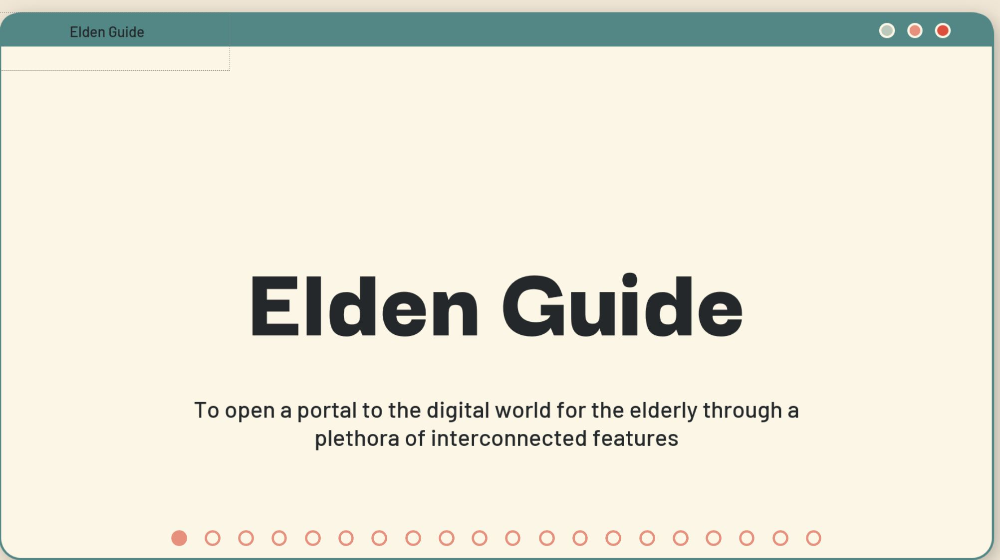
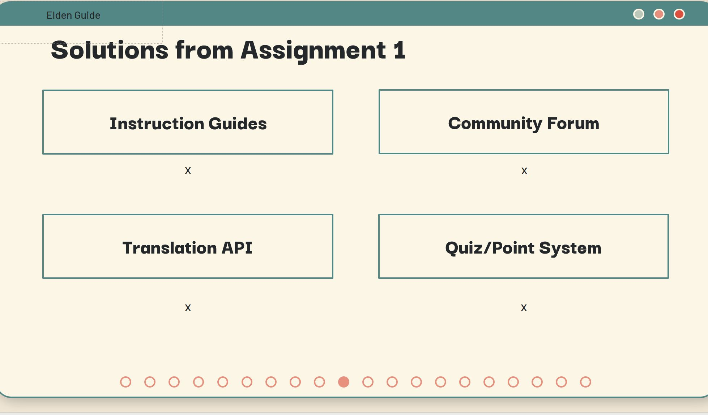
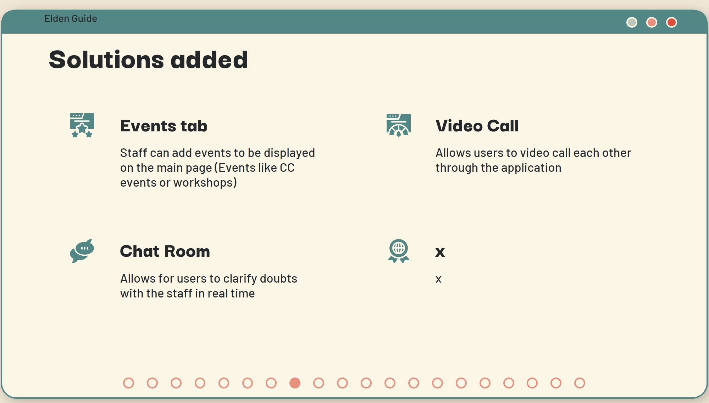

## Week 15

This is the last week of the PFD grind since the presentation is next week. I was still attempting to fix my code for user authentication, as well as completing the trello for Assignment 2 and doing the powerpoint slides for the presentation that is happening next week

Trello

Assignment 2 To Do:
This column lists tasks related to sustainability for guides, forum improvements, UI/UX improvements, user authentication, video calls feature, allowing PDF downloads for guides, and adding a chat room feature.

Sprint 1:
The first sprint focuses on the sustainability of guides, forum improvements, user authentication, creation, and editing of guides. The tasks seem aimed at setting up the core functionality of the platform.

Sprint 1 DoD (Definition of Done):
For Sprint 1, the DoD includes the ability to edit, create, and delete guides without hardcoding new HTML files, a forum with its own comment section, and user information showing up in the Firebase database with relevant details.

Sprint 2:
This sprint continues to build upon the platform's features with UI/UX improvements, forum improvements, video call features, user authentication, allowing PDF downloads for guides, and a chat room feature.

Sprint 2 DoD:
The criteria for completion of Sprint 2 include a more user-friendly UI/UX, particularly with designs that appeal to the elderly (the primary target audience), functionality for creating and displaying events, working video call features, a full user authentication system, the ability for users to download guides as PDFs, and an operational chat room where users can initiate conversations and receive support.

Some pics for the first draft of the slides:
  

This was some of the slides on the first draft ppt, we decided to change to another template as we found it to be more suitable for what the audience that we were mainly targeting ie. the elderlies.

Final Slides:
  
