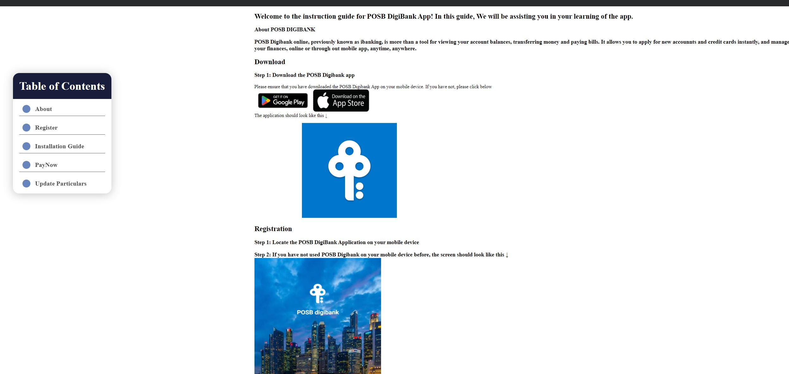
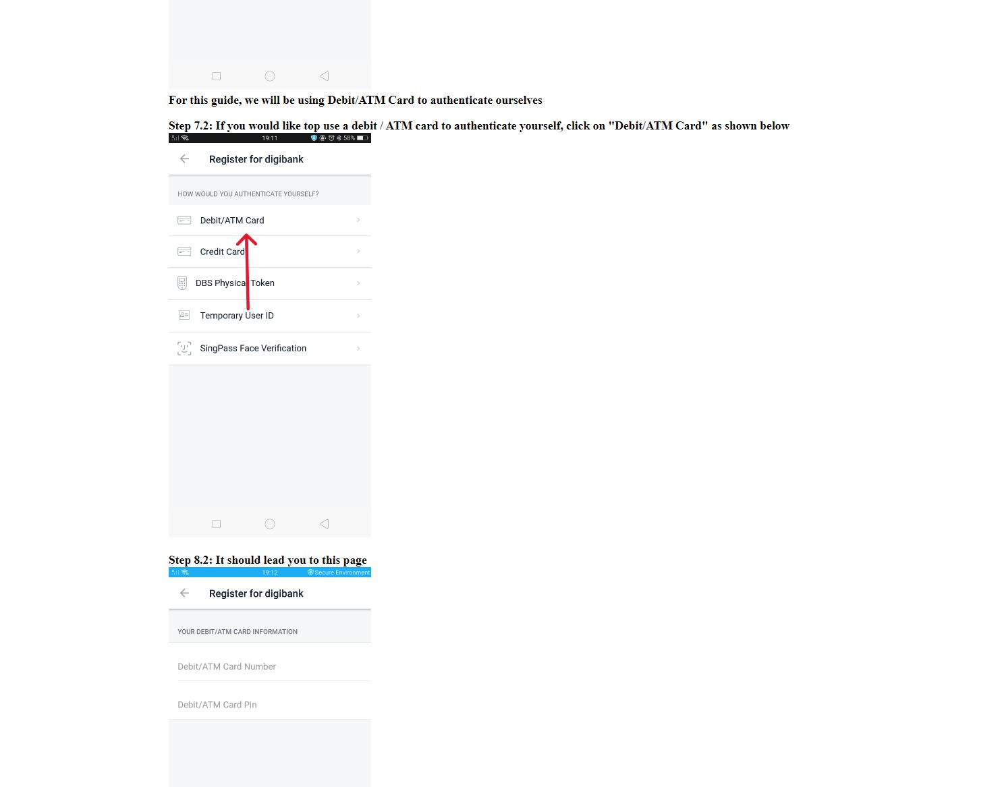
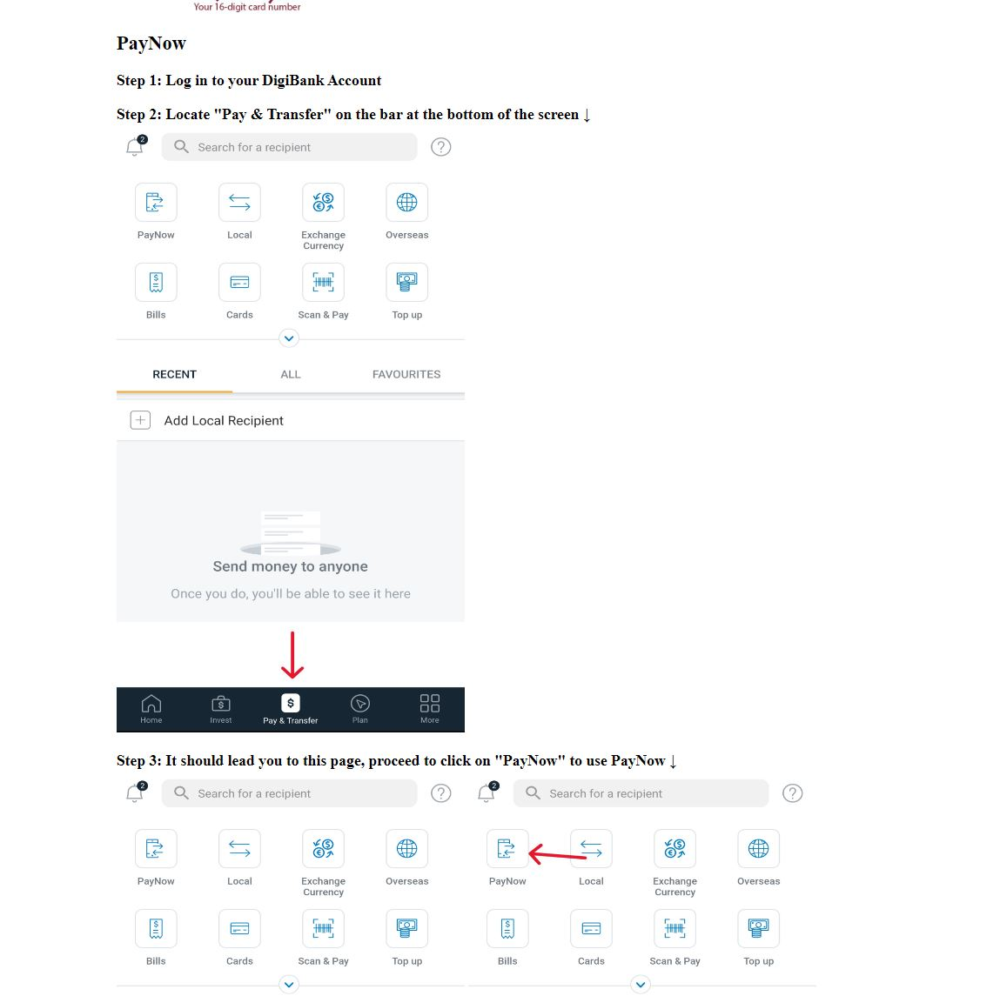

## Week 4

Week 4 commenced on a positive note, building upon the groundwork we laid in previous discussions to allocate workloads. Nonetheless, subtle design disagreements surfaced between Jeremy, Vishwa, and me. The crux of the matter revolved around their inclination to integrate quizzes, featuring point systems that would enable participants to redeem prizes on an instructional guide website. My dissent stems from concerns about potential complications, particularly considering the target audience for the instructional guide comprises the elderly population.

Several foreseeable issues arise from the proposed quiz and point system:

1. Exploitation of the points
   The potential for participants to manipulate the points system for their own benefit, thus weakening the initiative's integrity

2. what is going to stop the elderly from not taking the guide seriously and only using them to get points, thus defeating the purtpose of the guide in the first place
   Concerns about older people will not take the instruction guide seriously and will only use it to get points, which will lessen the guide's main intent.

3. Feeding to unhealthy competition pressure for the elderlies
   the potential for unhealthy competitiveness to develop among senior participants, adding needless strain and tension that runs counter to the guide's intended supporting nature.

4. Unintentionally putting pressure and frustrations to the elderly
   The unintentional imposition of pressure and frustration on the elderly, adversely affecting their user experience and overall satisfaction with the instructional material.

5. Potential scams that might arise due to this quizzes and points (Phishing scams, fake redemption offers)
   The increased vulnerability to potential scams, ranging from phishing attempts to fraudulent redemption offers associated with the quizzes and points system.

As the project has advanced, I have mostly concentrated on creating guides for three banking apps: DBS PayLah!, POSB Digibank, and OCBC Digital. My contribution to the OCBC Digital guide has been restricted to the registration section because I do not have an OCBC account.

These design issues must be resolved with considerable thought and cooperation. Taking into account the difficulties raised is essential to keeping the instructional guide relevant, engaging, and easily readable for the older audience for whom it is meant. Achieving a balance between gamification elements and maintaining the project's instructional integrity will be crucial to its success.

Some screenshots on what i did:

  
  
  

I should also be helping in doing the slides for the pitch as well
