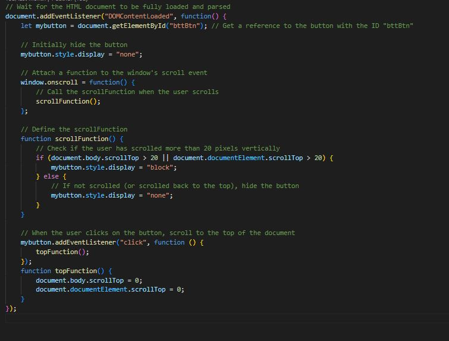

## Week 5

Week 5 marked the start of our Bytehack Hackathon experience, an event that offered us IT students challenges and learning possibilities.

### Day 1

The day started early, with us gathering at our chosen class location at 8.45 a.m. to ensure we didn't miss the essential 9 a.m. lecture. To be honest, I was nervous heading into the hackathon. Our initial concept, a web application directing elderly and foreign workers through Singapore's digital ecosystem, encountered severe obstacles. Recognizing the constraints, especially given the short 3-day schedule to create a Minimum Viable Product (MVP), I made a conscious decision to stand back from coding, recognizing my programming proficiency gap. I chose to help my peers whenever possible, contributing to code troubleshooting and working on CSS components. The first day was spent dealing with database and forum-related issues, laying the groundwork for what was to come.

### Day 2

Recognizing my coding limitations, I shifted my focus to a role where I could make a meaningful contribution. I took on the task of creating the presentation slides for the following day. Simultaneously, I discovered a way to improve user experience in our web application. I tried to address the issue of the application's length by implementing a JavaScript-based button feature for rapid navigation back to the top.

The introduction, problems, the product, the demo, and future improvements were the five main topics covered on the presentation slides. The project's goal, pertinent statistics, and key information about the team (us) were all presented in the introduction. The concerns section emphasized the shortcomings of the current guidelines and the difficulties users have, underscoring the necessity of our solution. We introduced Elden Guide and highlighted some of its features, such as a community forum, quiz/point system, translation API, and instruction guides. Future enhancements were described, including improving the Elden Guide Forum, making the website more responsive, and making the quiz system more user-friendly.

### Day 3

Our efforts came to a head on the last day as we got ready to deliver our solution to our instructor and stakeholders. It was clear that there would be fierce competition for our project because two other groups had submitted concepts that were similar to ours. An application designed for hawkers and an application for summarization were two other notable ideas. We tried our hardest, however we didn't do as well as we had planned, and the winners were another group and their summarizing application. This result made us think about how we went about things, how special our solution was, and how important it is to stand out in a crowded field.

Looking back, we can say that Bytehack Hackathon Week was a worthwhile experience that not only put our technical prowess to the test but also highlighted the value of creativity, originality, and flexibility when faced with obstacles. Even though our idea didn't win first place, the knowledge we gained during the hackathon will definitely help us as IT professionals improve.

#### Button

#### Button's Code

