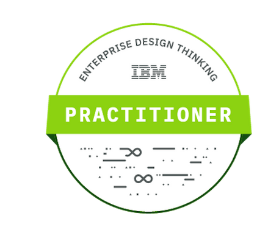

## Week 2 Reflection

For this week's OAL (23rd OCt to 27th Oct 2023), We first had to do some online learning in regards to Design Thinking Practioner in IBM.

After going through the course online and passing the quiz, we are able to get a badge on credly as well as a certification by IBM

Badge on Credly: 

#### IBM Enterprise Design Thinking Practitioner course

Upon reflection of my experience in the IBM Enterprise Design Thinking Practitioner course, I am amazed at the revolutionary influence it has had on my approach to creativity and problem-solving. Upon starting this course, I was excited to learn more about design thinking, but my understanding of the concept was quite limited. I had no idea how much it would influence my outlook and skill set.

An extensive introduction to the fundamentals of design thinking was given at the start of the course. I discovered that it's a human-centered method of handling challenging issues rather than merely being aesthetically pleasing. The training also covered IBM's proprietary framework, which offers distinctive tools and approaches that are suited to the environment of big businesses, for implementing design thinking at the enterprise level.

**Learning Journey**
I set out on this journey hoping to acquire some useful problem-solving techniques. As the training went on, I realized that design thinking is a mentality as much as it is a collection of skills. I began to see how effective empathy and user-centered design could be in solving problems in the real world.

**Key Takeaways**
The value of user-centered research was among the things I learned most from this course. To obtain profound understanding of the requirements and inclinations of our intended audience, I acquired the skill of conducting user interviews, surveys, and observations. My approach to difficulties in school has altered as a result of this newly acquired talent.

**Application of Knowledge**
Throughout the course, we applied our design thinking abilities to real-world projects. I was astounded at how our solutions improved and grew more user-focused with each iteration. I now approach every project with a fast prototype and iteration mindset.

**Impact on Problem Solving**
This course has changed the way I approach problem-solving. I now begin by rewording challenges to make sure they are clear and focused on the user. I try to find the underlying reasons of issues rather than just quick fixes, and this has helped me solve problems more successfully.

**Empathy and User-Centered Design**
I've learned the value of empathy through design thinking. It's second nature to me to put myself in the end users' shoes. It is now a method of viewing the world from a different angle rather than merely a procedure.

**Challenges and Growth**
There were difficulties in the course. Sometimes it was hard to reframe issues, or user research didn't produce the desired outcomes. But every obstacle presented a chance for development and learning. I discovered that a crucial component of the design thinking process was accepting failure and drawing lessons from it.

**Future Applications**
I can't wait to use the knowledge and skills I've gained from this course in my upcoming endeavors. I intend to apply design thinking to every facet of my job, making sure that I tackle issues with a user-centric perspective, empathy, and teamwork.

**Conclusion**
The experience of taking the IBM Enterprise Design Thinking Practitioner course has been life-changing. It has significantly altered my approach to problems and increased the range of tools I have for tackling them. As I proceed on my path as a practitioner of design thinking, I am appreciative of the abilities and perspective this course has given me.

I now know that design thinking is a method of thinking and seeing the world, not just a procedure. These lessons will be useful to me as I work to develop creative, user-centered solutions in my school modules as well as in th workforce in the future
